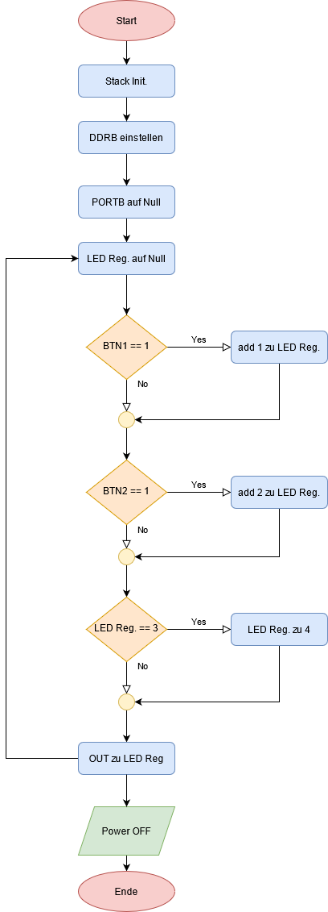
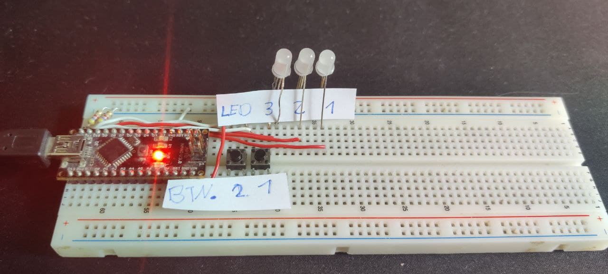
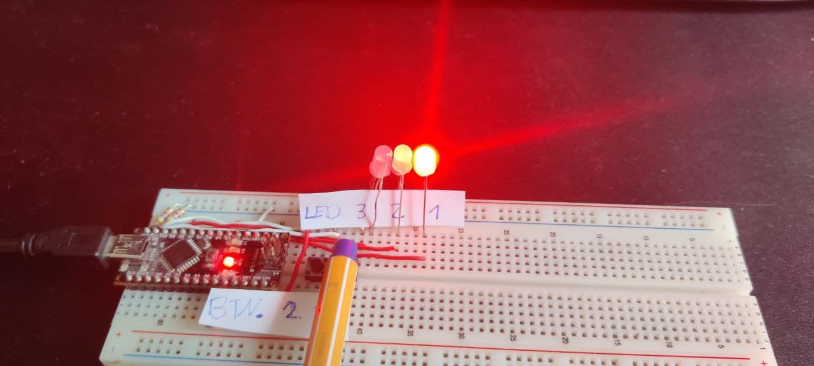
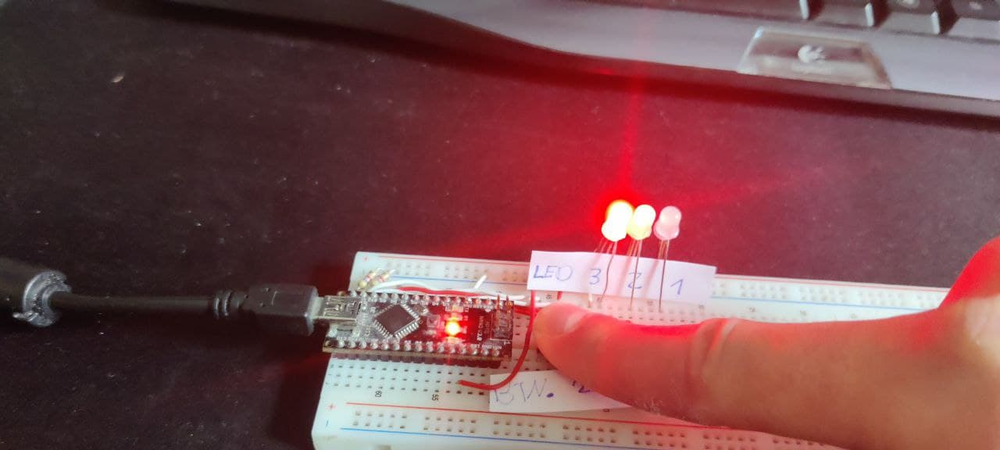

## Lab1Auf2
---
### Aufgabenstellung:
- Kein Taster betätigt      | Alle LEDs aus
- Taster 1 gedrückt         | LED 1 an
- Taster 2 gedrückt         | LED 2 an
- Taster 1 und 2 gedrückt   | LED 3 an

### Flowchart:

---

